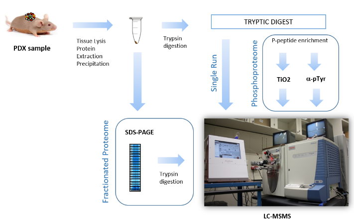

```{r, include=FALSE}
if (!require("BiocManager", quietly = TRUE))
    install.packages("BiocManager")
```


**URL REPOSITORI GITHUB** : https://github.com/marinaribessantolaria/Ribes-Santolaria-Marina-PEC1


# ABSTRACT

La fosforilació és una modificació posttraduccional que juga un rol essencial en la senyalització cel·lular i la regulació de processos cel·lulars. Per aquest motiu la comparativa de pèptids fosforilats resulta d'un ampli interès, ja que pot revelar diferencies clau en la funció i estat d'una proteïna en condicions diferents. Per aquest motiu, en aquest treball s'han interpretat diferències de perfils fosfoprotèics comparant dos fenotips de xenografts derivats de pacients (PDX) (fenotip MSS i fenotip PD). L'estudi estadístic de les dades proporcionades suggereix que hi ha diferències en el perfil fosfopeptídic segons el fenotip i entre aquestes diferències destaquem els pèptids P35269 i O00193, expressats diferencialment en les mostres MSS respecte a les PD.  

 
# OBJECTIUS DE L'ESTUDI

L'objectiu d'aquest estudi és:

*   L'ús de SummarizedExperiments per tal d'estudiar i descriure les dades de fosfoproteòmica.

*   Determinar si hi ha diferències entre mostres de dos fenotips diferents (MSS o PD) de PDX pel que fa al perfil de fosfopèptids enriquits en cada mostra.


# MATERIALS I MÈTODES

En aquesta activitat es treballa amb les dades proporcionades en el repositori de github: https://github.com/nutrimetabolomics/metaboData/. Més concretament, s'ha seleccionat el dataset de 2018-Phosphoproteomics.
 
Les dades contingudes en aquest dataset es tracten de 3 mostres de model PDX de fenotip MSS (mostres M1, M5 i T49) i 3 mostres de fenotip PD (M42, M43 i M64), amb un replicat tècnic de cada mostra. La forma en què s'han obtingut les dades és mitjançant l'extirpació del PDX del ratolí, l'enriquiment  de fosfopèptids en les mostres i finalment l'anàlisi mitjançant LC-MS. D'aquesta manera s'ha obtingut les seqüències modificades obtingudes (accessió) i el seu valor d'abundància per cada mostra i rèplica.

Podem visualitzar un resum del procediment que s'ha seguit en aquest diagrama que s'inclou en el repositori:



Respecte al processament de dades, s'ha utilitzat el programa RStudio i les eines Bioconstructor i SummarizedExperiments pel processament de dades. El projecte creat es troba sota control de versions gràcies a l'eina Git i el repositori Github (https://github.com/marinaribessantolaria/Ribes-Santolaria-Marina-PEC1).


# RESULTATS

Per tal de treballar amb les dades generem un SummarizedExperiment, que ha de constar dels següents elements:

*   Una matriu que serà utilitzada com a assaig o "assay", on s'inclouen els valors d'abundància de les diferents accessions obtingudes per cada mostra.

*   Una taula on es descriuen les mostres que s'han utilitzat.

*   Una taula on es descriuen les accessions, és a dir, els pèptids fosforilats.


*Font: Pàgina web Bioinfo Training, Chapter 2: RNA-Seq analysis with R and Bioconductor. Obtingut en l'enllaç: https://uclouvain-cbio.github.io/bioinfo-training-02-rnaseq/sec-se.html (Consultat per última vegada el 6 de novembre de 2024)*


```{r, include=FALSE}
#BiocManager::install("SummarizedExperiment")
library(SummarizedExperiment)
```

Per tal de generar el Summarized Experiment, en primer lloc, obtenim les dades del repositori:

Llegim el primer full de càlcul i ho assignem al dataframe 'phData':

```{r}
require(readxl) #utilitzem el paquet per llegir excels.
#Generem el dataframe 'phData'
phData <- read_excel(path= "TIO2+PTYR-human-MSS+MSIvsPD.XLSX", sheet=1) 
head(phData) #Visualitzem els primers valors del dataframe
```
Tal com podem veure aquest primer full de càlcul conté les seqüències de pèptids fosforilats, el seu número d'accessió, la descripció de la modificació a la qual correspon, un score que es dona per cada modificació seguida de la quantitat obtinguda per cada mostra i rèplica analitzada, finalment també s'inclouen la variable classe i fosfo.

Seguidament, llegim el segon full de càlcul i ho assignem al dataframe 'targets':

```{r}
#Repetim el mateix procés pel segon full de càlcul:
targets <- read_excel(path= "TIO2+PTYR-human-MSS+MSIvsPD.XLSX", sheet=2) 
show(targets)
```

Podem veure que en aquest segon datafame la informació que es proporciona es correspon a les mostres enviades, ens indica el número de la rèplica tècnica, el tipus de mostra que es tracta així com el fenotip. Podem veure que hi ha alguna informació redundant, ja que a partir de la primera columna en pots deduir la segona i la tercera. 

Per tal crear el Summarized Experiments, en primer lloc, hem de tenir clar les dimensions de les dades amb què treballem, podem determinar la dimensió de les dades proporcionades mitjançant la funció 'dim':

```{r}
dim(phData) #Uitlitzem el dataframe phData, ja que conté els valors d'interès
```

Podem veure que el dataframe conté 1438 files de dades, és a dir, 1438 fosfopèptids i 18 columnes, és a dir, 18 variables diferents.


## Creació del SummarizedExperiment

Tal com he mencionat prèviament, per tal de crear el SummarizedExperiment s'han de generar els seus components de forma individual (la matriu, la informació sobre les mostres i la de les accessions).


### Creem la matriu

Part de la matriu ja es troba en el data.frame proporcionat, com podem veure en les columnes de la 5 a la 16, que són les que contenen les mostres analitzades amb les abundàncies de cada accessió:

```{r}
abundances<-phData[,5:16] 
abundances #Visualitzem les columnes de la 5 a la 16 del dataferame phData
```

Per acabar de formar la matriu necessitem afegir-hi el nom del què correspon cada columna, és a dir, les diferents accessions dels fosfopèptids, per fer això, guardem les accessions en una variable que anomenem Accession_names:

```{r}
Accession_names<-phData$Accession #Generem la variable
head(Accession_names) #En visualitzem els primers valors
```


```{r}
matrix <- as.matrix(abundances) #Convertim el dataframe en la matriu de valors
rownames(matrix)<-Accession_names #Afegim les accessions com a nom de les columnes
matrix[1:5,] #Visualitzem els primers resultats de la matriu
```

Tal com podem veure en el resultat anterior, la matriu de valors té especificada en les columnes les mostres de l'estudi i en les files l'accessió del fosfopèptid quantificat en cada mostra.


Comprovem la dimensió de la matriu de valors obtinguda, que hem denominat 'matrix':

```{r}
dim(matrix)
```

Podem veure que en aquest cas hem reduït de 18 a 12 el nombre de columnes respecte al dataframe original, ja que aquesta matriu solament conté les 6 mostres analitzades i els seus duplicats (12 mostres en total).


### Creem la informació de les mostres

Editem la informació referent a les mostres per tenir-la de forma concisa:

```{r}
#Generem una variable que contingui el nom de les columnes de la matriu:
Samples<-colnames(matrix) 

#Afegim aquesta variable a la informació que ja teníem de les mostres:
targets$Samples = Samples 

#Reordenem les dades perquè la variable de les columnes aparegui la primera:
Targets <- targets[,c(5,1,2,3,4)]
Targets #visualitzem les dades que corresponen a les mostres
```


Aquesta és la informació que se'ns ha proporcionat sobre les mostres i que volem incloure en el SummarizedExperiment. Per això, hem de tenir informació sobre 12 mostres, ja que aquesta és la quantitat de columnes que té la nostra matriu de valors.

Com podem veure, tenim tates files com nombre de columnes que té la matriu de valors, una per cada mostra analitzada:

```{r}
dim(Targets)
```

### Creem la informació de les accessions

Seguim un procés similar a l'anterior per tal de generar la informació que volem introduir en el SummarizedExperiment sobre els fosfopèptids detectats en la fosfoproteòmcia:   

```{r}
accession <-  phData[,1:3] #Seleccionem les 3 primeres columnes de phData

#Reordenem les dades perquè l'accessió aparegui com a primera columna:
Phospho<- accession[,c(2,1,3)] 
head(Phospho) #Visualitzem les dades
```

Donat que aquestes dades corresponen a la informació sobre els fosfopèpetids obtinguts, la quantitat de files que hi ha d'haver en les dades 'Phospho' han de ser equivalents a les de la matriu de valors: 

```{r}
dim(Phospho) #Visualitzem les dimensions de les dades
```
Podem veure que en els dos casos tenim 1438 columnes, per tant, podem seguir amb la creació del SummarizedExperiment.


Finalment, creem el SummarizedExperiment, que denominem com a 'se' utilitzant el comando 'SummarizedExperiment':

```{r}
#Creem el SummarizedExperiment
se <- SummarizedExperiment(assays = list(counts = matrix),colData = Targets, rowData = Phospho)
se #Visualitzem el seu contingut
```

Podem veure en el codi anterior que en l'apartat 'assays' hi hem afegit la matriu de valors, en 'colData' les dades referents a les mostres i en rowData, la informació dels fosfopèptids. Quan en visualitzem el resum, podem veure que s'ha creat exitosament la classe amb tota la informació proporcionada. No obstant, podem apreciar que hi ha un apartat on hi manca informació, que es tracta de l'apartat metadata. L'apartat metadata conté informació rellevant sobre les dades disponibles en el SummarizedExperiment, com ara annexos o fórmules. En el nostre cas, en les dades proporcionades no hi ha massa més informació adicional, per aquest motiu hi afegim una breu descripció de l'experiment:


```{r}
#Afegim en la metadata una descripció de l'experiment:
metadata(se)$description <- c("The acompanying dataset has been obtained from a phosphoproteomics experiment
The experiment has analyzed (3 + 3) PDX models of two different subtypes using Phosphopeptide enriched samples.
LC-MS analysis of 2 technical duplicates has been performed on each sample.
The results set consisted of Normalized abundances of MS signals for ca. 1400 phosphopeptides
Goal of the analysis: **search phosphopeptides that allow differentiation of the two tumor groups*
This should be made with both Statistical Analysis and visualization.
Data have been provided as an excel file: TIO2+PTYR-human-MSS+MSIvsPD.XLSX

Groups are defined as:
- MSS group: Samples M1, M5 and T49,
- PD group: Samples M42, M43 and M64 with two technical replicates for each sample
The first column, *SequenceModification* contains abundance values for the distinct phosphopetides. Other columns can be omitted.")

#Tornem a visualitzar per tal de confirmar que ara a metadata hi ha informació
se 
```

*Font: Pàgina web RDRR. Obtingut en l'enllaç: https://rdrr.io/bioc/SummarizedExperiment/f/vignettes/SummarizedExperiment.Rmd (Consultat per última vegada el 6 de novembre de 2024)*


## Anàlisi del SummarizedExperiment creat


### Comprovació de la informació disponible en el SummarizedExperiment

De la classe SummarizedExperiment creada en podem obtenir tota la informació disponible de la següent manera:

1.    Obtenció de la informació sobre les mostres:


```{r}
# Accedim a la informació de les mostres mitjançant colData:
colData(se)
```

2.    Obtenció de la informació sobre els fosfopèptids detectats:

```{r}
# Accedim a la informació de les accessions mitjançant rowData:
rowData(se)
```


3.    Obtenció de la matriu de valors:
```{r}
# Accedim a la matriu de valors:
head(assays(se)$counts) #En visualitzem solament els primers valors
```


4.    Obtenim les metadades relacionades:

```{r}
# Accedim a les metadades:
metadata(se)$description
```

Amb aquest últim pas podem veure que la classe funciona correctament i conté tota la informació que li hem proporcionat.


### Descripció general de les dades

Mitjançant el Summarized Experiment es permet d'una forma fàcil i senzilla respondre a diferents preguntes sobre les dades de la fosfoproteòmica.

Per exemple, si llegim la descripció que es proporciona en la metadata podem averiguar el nombre variables de l'experiment:

```{r}
metadata(se)$description
```
En aquest cas, ens queda clar que són dues condicions diferents (dos fenotips, MSS i PD) compostos per 3 mostres cada un amb dues repeticions per mostra. Les informacions sobre les mostres estudiades es podria accedir ràpidament tal com hem fet anteriorment amb 'colData' així com la informació dels pèptids obtinguts que es podria obtenir amb 'rowData'. D'una froma més breu, per determinar la quantitat de mostres amb què treballem, ho podem veure mitjançant el càlcul de les dimensions de la matriu de valors:

```{r}
dim(assays(se)$counts)
```
Podem veure que hi ha 1438 columnes, és a dir, 1438 fosfopèptids estudiats i 12 mostres, que corresponen a les columnes.

També veiem que en la matriu no hi ha cap NA, fet que és imprescindible de determinar abans de prosseguir amb l'anàlisi de les dades:

```{r}
table(is.na(assays(se)$count))
```

Podem obtindre fàcilment estadístiques bàsiques sobre les abundàncies obtingudes per cada mostra:
Obtindre estadístiques i gràfics simples:

```{r}
summary(assays(se)$count)
```


Aquestes dades també poden ser representades gràficament:

```{r}
boxplot(assays(se)$count)
```

De la representació de les diferents abundàncies en podem extreure dues coses; que les abundàncies detectades entre mostres varien àmpliament entre elles, i que degut a que es tracten a dades en exponents, seria interessant manipular les dades en base logarítmica. A continuació visualitzem les dades, però en escala log10:

```{r}
logmatrix<-log10(assays(se)$count+1) #Transformem la matriu, hi sumem 1 per evitar prOblemes amb valors 0.
#Visualitzem en forma de boxplot les dades transfomrades:
boxplot(logmatrix, las=2, main="Phosphoproteomics Experiment. Abundance in log 10 scale")
```


També podem visualitzar les mitges d'abundància de les diferents mostres:


```{r}
#Creem un vector que conté les mitges de les columnes de la matriu de valors
mean_sample<-colMeans(assays(se)$count) 
mean_sampledf<-stack(mean_sample) #Creem un dataframe amb les mostres i les mitges
mean_sampledf #Visualitzem el dataframe

```

Podem veure que aquesta informació concorda amb la visualitzada anteriorment amb la funció 'summary' de la matriu de valors. Podem representar gràficament aquests valors de la forma següent:


```{r}
library(ggplot2)
ggplot(mean_sampledf, aes(x=ind, y=values))+
  geom_col()
```

Podem veure un resultat similar al vist amb els boxplots.

Pel que fa a les dades dels fosfopèptids, podem obtenir una informació similar:

```{r}
mean_accession<-rowMeans(matrix) #Calculem la mitja d'abundància per accessió
mean_accessiondf<-stack(mean_accession) #Creem el dataframe amb la informació
head(mean_accessiondf) #Visualitzem el dataframe

```

Podem representar gràficament aquesta informació mitjançant el barplot següent:

```{r}
ggplot(mean_accessiondf, aes(x=ind, y=values))+
  geom_col()
```

En tenir tanta informació resulta una mica entendre el resultat obtingut. Tot i que podem veure que les abundàncies varien enormement segons el fosfopèptid. Per tal de determinar quins són els pèptids més abundants seguim els següents passos:

```{r}
#Ordenem les dades per quantitat
quant_accession<-mean_accessiondf[order(mean_accessiondf$values,
                                decreasing = TRUE), ]
#Visualitzem les dades i comprovem que estan en l'ordre adequat
head(quant_accession)
```

A continuació veiem els 10 fosfopèptids més abundants detectats en les mostres:

```{r}
#Seleccionem les 10 primeres entrades, corresponents als pèptids més abundants
highaccesion<-quant_accession[1:10,]

#Visualitzem gràficament aquestes dades mitjançant un barplot:
ggplot(highaccesion, aes(x=ind, y=values))+
  geom_col()
```


Tot i que és interessant la visualització d'aquesta informació, no ens són de massa utilitat per la finalitat d'aquest treball, que és la comparació dels diferents perfils de fosfopèptids obtinguts en les diferents mostres. Per això és necessari l'ús d'eines per la comparació, que veurem en el següent apartat.

### Comparació del perfil fosfopeptídic de les dades obtingudes

El primer pas per la comparació de les dades obtingudes és generar una matriu de correlació a partir de la matriu de valors del SummarizedExperiment:

```{r}
#Generem la matriu de correlació amb la funció 'cor':
corrmatrix<-cor(assays(se)$count) 
round(corrmatrix, 2) #La visualitzem arrodonint els valors a 2 decimals
```

Aquesta matriu ens compara les diferents mostres entre elles i ens determina la seva similitud. Com podem veure, tenim una diagonal de valors 1 d'esquerra a dreta que corresponen a la comparació de la mateixa mostra, on la similitud és màxima.

Podem representar gràficament aquestes correlacions de diferents maneres:

```{r}
#install.packages("corrplot")
library(corrplot)
corrplot(corrmatrix,
         tl.col = "black", tl.srt = 45)
```

Gràcies a aquest gràfic podem veure com de similars són aquestes mostres entre elles. Veiem la diagonal de blau fosc que indica una màxima similitud a l'hora de comparar les mateixes  mostres.

-    Generalment podem veure que els replicats de les mostres són molt similars entre ells, sent la mostra M1 l'única excepció.

-     Podem veure que hi ha certes diferències entre fenotip MSS i PD, però depenen en part de la mostra que s'estudia, ja que, per exemple, les mostres M1 (MSS) són molt diferents a M43 (PD), i M64 (PD), però són més  similars a la mostra M42 (PD).


Alternativament, també podem visualitzar aquestes dades amb un heatmap:

```{r}
col<- colorRampPalette(c("blue", "white", "red"))(20)
heatmap(x = corrmatrix, col = col, symm = TRUE)
```


Si normalitzem les dades de la matriu de valors, en podem comparar l'abundància de pèptids per cada mostra, per això, utilitzem la funció 'scale':

```{r}
data_normalized<-scale(assays(se)$count) #Normalitzem els valors de la matriu
head(data_normalized)#En visualitzem els primers valors
```

Si en comparem les abundàncies, sent de color blau els valors menys abundants i en vermell els més, obtenim la informació següent:

```{r}
col<- colorRampPalette(c("blue", "white", "red"))(20)
heatmap(x = data_normalized, col=col)
```
Podem veure cada accessió i la seva quantitat per mostra. Podem veure que el heatmap ordena les mostres per similitud, i que aquestes estan ordenades per fenotip per l'excepció de la mostra M49, que és situada juntament a les mostres de fenotip PD. Podem veure que el perfil de fosfopèptids resulta bastant depenent de la mostra de PDX analitzada i que les rèpliques són altament similars entre elles a excepció de la mostra M1, com ja havíem vist abans.

*Font: Pàgina web STHDA: Statistical tools for high-throughput data analysis. Obtingut en l'enllaç: http://www.sthda.com/english/wiki/correlation-matrix-a-quick-start-guide-to-analyze-format-and-visualize-a-correlation-matrix-using-r-software (Consultat per última vegada el 6 de novembre de 2024)*


També podem estudiar les dades mitjançant una anàlisis de components principals (PCA). Primer fer el PCA i després en podem representar els primers components:

```{r}
#Fem el PCA a partir de les dades normalitzades:
library(stats)
pca<-prcomp(data_normalized, scale.=TRUE) 
summary(pca) #En visualitzem el resum
```

Podem veure que s'han generat els 12 components principals (PC1-PC12) que corresponen al nombre de variables de les nostres dades. Cada component explica un percentatge de la variància total del dataset. Podem veure, en la proporció acumulada que els dos primers datasets expliquen un 81.59% de la variància del dataset. És a dir, més de tres quarts de la informació del dataset pot ser representat amb aquests dos components principals i aquest suposen una representació acurada de les dades.

Podem representar gràficament aquest PCA:

```{r, include=FALSE}
#install.packages("factoextra")
library(factoextra)
```

```{r}
#Representem gràficament el PCA
fviz_pca_var(pca, col.var = colData(se)$Phenotype) #Indiquem que el color correspongui al fenotip
```

Aquest gràfic revela informació similar a la proporcionada anteriorment. Generalment, hi ha diferències entre fenotips MSS i PD a excepció de la T49 MSS i algunes repeticions de mostres PD (M62_2 I M43_2), que també podíem observar en el heatmap.

Donada a la diferència de la mostra T49, resultaria interessant saber si hi ha alguna diferència d'aquest xenograft respecte a la resta de PDX de fenotip MSS que pugui explicar la seva similitud al fenotip PD.


Podem analitzar les dades mitjançant clústers, a continuació farem servir el sistema K-means, àmpliament popular en l'anàlisi de clústers. Aquest mètode, però, requereix que s'especifiqui el nombre de clústers que s'han d'extreure de forma manual, per tal de determinar-ho fem el gràfic de suma de quadrats dins dels grups o within sum of squares error (WSS). 

```{r}
# Fem la visualització del decreixement de la suma de quadrats dins dels grups
#Fem el càlcul de la suma de quadrats dins de grups
wss <- (nrow(data_normalized)-1)*sum(apply(data_normalized,2,var)) 
for (i in 2:15) wss[i] <- sum(kmeans(data_normalized,
   centers=i)$withinss)
plot(1:15, wss, type="b", xlab="Number of Clusters",
  ylab="Within groups sum of squares")
```
```{r}
library(tibble)
# Determinem el nombre de clústers
n_clusters <- 10

# Inicialitzem el total dins del wss
wss <- numeric(n_clusters)

set.seed(324)

# Mirem de 1 a 10 possibles clústers
for (i in 1:10) {t
  km.out <- kmeans(data_normalized, centers = i, nstart = 20)
  wss[i] <- km.out$tot.withinss
}

# Generem el gràfic:
wss_df <- tibble(clusters = 1:10, wss = wss)
 
scree_plot <- ggplot(wss_df, aes(x = clusters, y = wss, group = 1)) +
    geom_point(size = 4)+
    geom_line() +
    scale_x_continuous(breaks = c(2, 4, 6, 8, 10)) +
    xlab('Number of clusters')
scree_plot
```


Aquest gràfic ens ajuda a determinar el nombre de clústers apropiats. Podem veure que a partir el colze de la gràfica es troba a 3, a partir d'aquest valor el decreixement és molt més pausat, si marquem diferents línies en cada punt la visualització d'aquesta diferència resulta més evident:

```{r}
scree_plot +
    geom_hline(
        yintercept = wss, 
        linetype = 'dashed', 
        col = c(rep('#000000',2),'#FF0000', rep('#000000', 7))
    )
```

*Font: Pàgina web Datacamp: Tutorial K-Means clusterin in R. Obtingut en l'enllaç: https://www.datacamp.com/tutorial/k-means-clustering-r (Consultat per última vegada el 6 de novembre de 2024)*


Si fem el anàlisi de clústers, dividint per 3 clústers diferents:

```{r}
fit <- kmeans(data_normalized, 3) # Especifiquem el nombre de clústers a 3 
#  Obtenim les mitges dels clústers
aggregate(data_normalized,by=list(fit$cluster),FUN=mean)
# Ho introduïm a un dataframe denominat mydata
mydata <- data.frame(data_normalized, fit$cluster)
```


Podem visualitzar aquesta informació gràficament de la manera següent:

```{r, include=FALSE}
#install.packages("fpc")
```

```{r}
# K-Means Clustering amb 3 clústers
fit <- kmeans(mydata, 3)

# Cluster Plot contra el 1r i el 2n PC:   
library(cluster)

clusplot(mydata, fit$cluster, color=TRUE, shade=TRUE,
   labels=2, lines=0)

library(fpc)
plotcluster(mydata, fit$cluster)
```

Podem veure que hi ha determinats pèptids que són agrupats de forma conjunta: Q13523, P29692, P08238.3, P07900.4, P07335.1, P4984. Podria resultar interessant estudiar la correlació d'aquests fosfopèptids, així com els que integren el 2n clúster.  


A continuació podem visualitzar els clústers amb dendrogrames, per exemple aquí visualitzem un dendrograma jeràrquic generat amb el mètode euclidià.

```{r}
# Clustering jeràrquic
d <- dist(mydata,
method = "euclidean") 
fit <- hclust(d, method="ward.D")

plot(fit) # Visualitzar el dendrograma 
groups <- cutree(fit, k=3) # Dividir l'arbre en 3 clústers
# Dibuixar en el dendrograma quadres vermells al voltant dels 3 clústers 
rect.hclust(fit, k=3, border="red")
```

El resultat dels clústers generats resulta similar, no obstant la interpretació amb aquesta visualització resulta menys pràctica que la dels clústers sobre el PCA.


### Determinació d'accessions enriquides segons la condició

Per tal de determinar fosfopèptids que estan diferencialment enriquits utilitzarem el paquet 'limma':


```{r}
library(BiocManager)
#install("limma")
library(limma)
```

Per tal de utilitzar lima necessitem una matriu de disseny que descrigui les variables i una on es donin les comparacions.

Creem la matriu de les variables on establim a quin fenotip correspon cada mostra: 

```{r}
#Generem la matriu de disseny que descrigui el fenotip de les mostres:
targets <- as.data.frame(targets)
groups <- as.factor(targets$Phenotype)
designMat <- model.matrix(~ -1 + groups)
show(designMat) #Visualitzem la matriu de disseny
```

Per tal d'interpretar les rèpliques tècniques de la mateixa mostres fem servir la funció  `duplicatecorrelation` que ens dona la correlació mitja entre replicats: 

```{r}
correpr <- duplicateCorrelation(matrix, designMat,block=targets$Individual) #Determinem la correlació mitja entre rèpliques
correpr$consensus.correlation
```

Generem una matriu de contrast on veure les comparacions: 

```{r}
require(limma)
contMat <- makeContrasts(mainEff=groupsPD-groupsMSS, levels=designMat) #Generem la matriu
show(contMat) # La visualitzem
```

Ara que tenim les dos matrius podem comparar les abundàncies de pèptids per cada fenotip de mostra: 

```{r, warning=FALSE}
model.comparison <- lmFit(matrix, designMat, block=targets$Individual,correlation=correpr$consensus)
comparison <- contrasts.fit(model.comparison, contMat)
comparison <- eBayes(comparison)
results<- topTable(comparison, adjust="BH",  number=nrow(matrix))
head(results) #Visualizem solament les primeres dades
```

Tal com podem veure en el resultat, obtenim els fosfopèptids ordenats de més diferencialment expressat a menys. Podem visualitzar aquest resultat en un volcanoplot, on en l'eix vertical tindrem la diferència estadística i en l'horitzontal la diferència d'abundància entre fenotip MSS i PD, sent les mostres de la dreta els fosfopèptids enriquits  en el fenotip PD mentre que en l'esquerra del zero tenim els enriquits en el fenotip MSS:

```{r}
#Visualitzem en el volcano plot les 6 accessions amb un p-value més reduït
volcanoplot(comparison, highlight=6, names=rownames(matrix), cex=0.75,
            xlim=c(-1e+06,1e+06))
```

Si seleccionem aquests 6 pèptids i visualitzem la seva quantitat amb un heatmap veiem que efectivament la seva expressió és diferencial depenent del fenotip de la mostra:

```{r}
#Fem una matriu que solament contingui els 6 pèptids seleccionats:
interestedacc<-c(1323,454, 410, 86, 226,146) 
subaccesion<- matrix[interestedacc, , drop=FALSE] 
norm.subacc<-scale(subaccesion) #Escalem les dades i en fem un heatmap:
col<- colorRampPalette(c("blue", "white", "red"))(20)
heatmap(x = norm.subacc, col=col)
```

Entre els pèptids seleccionats destaquem P35269 que es troba molt més en les mostres MSS respecte a les PD, i el pèptid O00193 es troba en el cas contrari, sent més upregulat en les mostres de fenotip PD.


# DISCUSSIÓ, LIMITACIONS I CONCLUSIONS DE L'ESTUDI

L'estudi de diferències fosfopeptídiques entre mostres de PDX pot ser una forma interessant d'encarar patrons i vies de senyalització diferencialment expressades en diferents malalties. Aquest estudi, no obstant no ens permet discernir amb massa exactitud perfils clars entre les mostres. Majoritàriament, això és degut al fet que la qualitat de les dades és baixa, una evidència d'aquest fet és la gran variabilitat mostral i la presència de replicats tècnics amb perfils peptídics diferents entre ells. Per aquest motiu seria necessari considerar reanalitzar algunes dades, com és el cas de la mostra M1. No obstant així, hem pogut evidenciar que hi ha certa diferència entre els fenotips de PDX PD i MSS a nivell fosfopeptídic, especialment dos fosfopèdptids amb número d'accessió P35269 i O00193.

